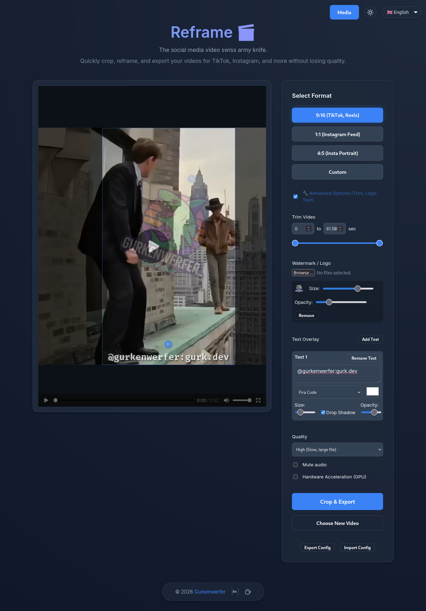

# Reframe 🎬📐

Reframe is a self-hosted web app for cropping and formatting videos for social media. If you have 16:9 recordings, streams, or clips, you can use Reframe to quickly convert them to 9:16 (TikTok/Reels), 1:1 (Instagram), or other formats. 

Everything runs locally via Docker, so your files never leave your machine.



## Features

- **Cropping & Formatting:** Web UI to set up your video crop. Includes presets for 9:16, 1:1, 4:5, and custom aspect ratios.
- **Batch Processing:** Apply the exact same crop, trim, and overlay settings to multiple videos at once.
- **Scripting API:** A REST endpoint (`/api/automate`) lets you trigger video processing programmatically by sending JSON configurations.
- **Import/Export:** Save your settings as a preset file and load them later.
- **Media Manager:** View all your uploaded and exported media in a sleek list. Exported videos automatically display their rich metadata and full extracted transcripts.
- **Custom Fonts:** Upload `.ttf` and `.otf` files through the app to use them in text overlays and subtitles.
- **Auto-Subtitles (Whisper AI):** Automatically generate dynamic, TikTok-style word-by-word subtitles with customizable fonts, stroke, and highlight colors.
- **Model Manager:** Download and manage local Whisper AI models directly from the UI for fully offline transcription.
- **Watermarks & Overlays:** Add logos or text (with adjustable colors and drop shadows) to your videos.
- **Trimming:** Cut the start and end of your video.
- **Hardware Acceleration:** Uses FFmpeg with GPU support for faster exports and Whisper transcription.
- **Localization:** UI supports English, German, Spanish, and French.
- **Dark Mode:** Toggles between light and dark themes.

## Tech Stack

- **Backend:** Python / FastAPI
- **Processing:** FFmpeg
- **Frontend:** Vue 3 / Vite
- **Deployment:** Docker & Docker Compose

## Quick Start

You can start the Reframe container using the following `docker-compose.yml`:

```yaml
version: '3.8'

services:
  reframe:
    image: ghcr.io/stefexec/reframe:latest
    container_name: reframe
    ports:
      - "8080:8080"
    volumes:
      - ./media/uploads:/app/uploads
      - ./media/exports:/app/exports
      - ./media/fonts:/app/fonts
      - ./media/models:/app/models
    restart: unless-stopped
```

Once running, open `http://localhost:8080` in your browser.

## Roadmap

- [ ] **Smart Tracking:** Auto-crop using YOLOv8 face detection to keep the subject centered.
- [ ] **Audio Normalization:** Auto-adjust volume for social platforms.

## Support the Project ☕

If you find Reframe useful and would like to support its continued development, donations are greatly appreciated! 

**Crypto Addresses:**
- **BTC:** `bc1qytee2a0z2tg4k4zdtqj08zpellkrecrgdgg36z`
- **ETH:** `0x49372575383aEA56b78524C4FD0873DE1175e9be`
- **LTC:** `ltc1qk2pe4srtcjt2cnnp5fcfvmknwckjus9ge8v5p9`

Alternatively, you can [Buy Me a Coffee](https://www.buymeacoffee.com/gurkenwerfer). Thank you! 💖
